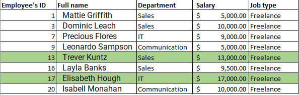

# Data manipulation and management

## Introduction
This excel task introduces the basics of microsoft excels such as: Filtering data, conditional formatting, removing duplicates, sorting data and splitting of cells.
This task required a dummy dataset.

## Concept demonstrated
The following microsoft excel concepts were used:- Data validation, filtering of data, conditional formatting, splitting of cells and checking for duplicates.

## Problem statement

  ### 1. Data entry
   
   A dataset of 20 rows was created and informations were inputted under the following fields: Employee ID, Employee full name, Department (Communication, sales and IT), Salary (between $5000-$25000) and job type (Part-time, freelance, contract)
   
   
---

 ### 2. Only Freelance employee and highlight those whose salaries are above $10000

 
 ---

### 3. Split names into first and last name and check for duplicates, if any highlight.

---

### 4. Highlight employee whose names begin with letter "E" in yellow. Format salary coloumn such that the highest salary has a green background and the lowest salary a red background.

---

## Conclusion

 
 
